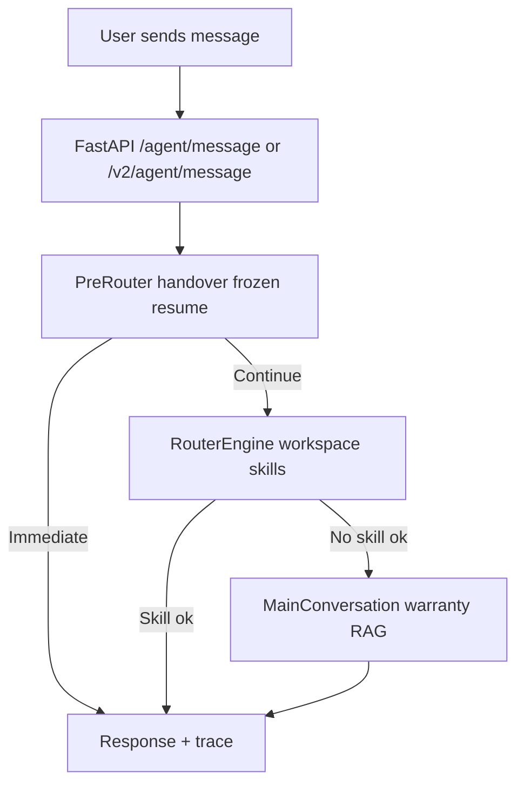

# Kai Kommu ChatBot  

An AI-powered assistant for **Kommu**.  
Designed to handle customer and internal support queries with **speed, accuracy, and bilingual support (English & Malay)**.

---

##  Features

- **RAG (Retrieval-Augmented Generation):** FAQ markdown (`agent_workspace/02_knowledge/faq/master_faq.md`) indexed with FAISS; optional Google Doc sync overwrites only the `<!-- sop-sync:* -->` region  
- **Agent workspace:** Markdown-first core prompts, FAQ, and v2 skill metadata under `agent_workspace/` (see `agent_workspace/README.md` and `00_manifest.md`)  
- **Google Sheets Integration:** Warranty & stock lookups  
- **Multi-language:** English ↔ Bahasa Melayu auto-switching  
- **WhatsApp Integration (via Twilio)**  
- **Daily Auto-Refresh** of SOP & Google Sheets  
- **Debug, Health & Benchmark Tools** to test coverage and performance  

---

##  Setup

### 1) Clone & prepare environment

```bash
# Clone
git clone https://github.com/kommuai/kai.git
cd kai

# (Recommended) Python 3.10–3.12
python -m venv .venv
# Windows
.venv\Scripts\activate
# macOS / Linux
# source .venv/bin/activate

# Install deps
pip install -r requirements.txt
```

### 2) Configure environment

Create a `.env` file:

```bash
# Minimal required (examples)
DEEPSEEK_API_KEY=sk-xxxxxxxxxxxxxxxxxxxxxxxx
SOP_DOC_URL=https://docs.google.com/document/d/xxxxxxxxxxxxxxxxxxxx
WARRANTY_CSV_URL=https://docs.google.com/spreadsheets/d/e/.../pub?gid=0&single=true&output=csv
EXTRA_WARRANTY_CSV_URL=https://docs.google.com/spreadsheets/d/e/.../pub?gid=0&single=true&output=csv
```

Or hardcode in `config.py`.

### 3) Run locally

```bash
# App (FastAPI + uvicorn)
uvicorn app:app --host 0.0.0.0 --port 8000
# Health check
curl http://127.0.0.1:8000/
```

### 4) Run with Docker

```bash
docker compose up -d
# health
curl http://127.0.0.1:6090/
```

Docker mounts `./agent_workspace` at `/app/agent_workspace`. Session SQLite stays on `./data` → `/data/sessions.db` (see `00_manifest.md` frontmatter `session_store`).

**Env (optional):**

- `AGENT_WORKSPACE` — path to workspace root (default: `agent_workspace` next to `app.py`)
- `MASTER_FAQ_PATH` — override FAQ markdown path
- `CONTEXT_REGISTRY_YAML` — override path to `agent_workspace/04_context/context_registry.yaml`

Exposed endpoints (in Docker):

- `http://127.0.0.1:6090/agent/message`
- `http://127.0.0.1:6090/v2/agent/message`
- `http://127.0.0.1:6090/v2/agent/query`
- `http://127.0.0.1:6090/v2/agent/search`
- `http://127.0.0.1:6090/admin/refresh-sop`
- `http://127.0.0.1:6090/admin/reset_memory`

Route mode (workspace skills + main conversation):

- `KAI_ROUTE_MODE=hybrid` (default) — try skills after session/handover gate, then `main_conversation` if no skill succeeds
- `KAI_ROUTE_MODE=agent_first` — same router ordering today; reserved for stricter agent preference later
- `KAI_ROUTE_MODE=stable_only` — treated as `hybrid` (legacy env value)

Both `POST /agent/message` and `POST /v2/agent/message` use the same handler (trace fields always included). Shadow logging runs only on `/v2/agent/message` when `KAI_SHADOW_MODE` is on.

Machine-agent auth for `/v2/agent/*`:

- `KAI_SERVICE_KEYS=internal-key:public_info.read|repo.read|media.read`
- `KAI_GITHUB_TOKEN=<optional_github_token_for_higher_rate_limits>`
- Repo-reader scope is hard-locked to public repos under `https://github.com/kommuai`.

---

##  Debug & Health Checks

### A) One-shot full system check (CLI)

```bash
python debug_check.py
```

Expected output:

```
[SOP-DOC] Loaded 50 Q/A from Google Doc and rebuilt RAG.
[WARRANTY] Loaded total rows: 476; 308 unique dongle ids; 98 phone/serial keys.
[HEALTH] All templates OK.
[LANG] Detector ready (EN/BM).
[OK] System is ready.
```

### B) Runtime checks (HTTP)

```bash
# Trigger SOP + warranty refresh manually
curl -X POST http://127.0.0.1:6090/admin/refresh-sop

# Reset one conversation memory
curl -X POST "http://127.0.0.1:6090/admin/reset_memory?user_id=+6000000000"
```

### C) Test message route manually

```bash
curl -X POST http://127.0.0.1:6090/agent/message \
  -H "Content-Type: application/json" \
  -d '{"phone_number":"+6000000000","content":"Hi, what cars are supported?"}'
```

### D) Test machine-agent query (A2A)

```bash
curl -X POST http://127.0.0.1:6090/v2/agent/query \
  -H "Content-Type: application/json" \
  -H "x-api-key: internal-key" \
  -d '{"user_id":"agent-client","query":"What is KommuAssist?","lang":"EN"}'
```

---

##  Daily Auto-Refresh

Script path: `/home/deployment-user/bin/kai-refresh.sh`

Cron (every day 9:00 AM):

```bash
0 9 * * * /home/deployment-user/bin/kai-refresh.sh >> /home/deployment-user/kai-refresh.log 2>&1
```

Run manually:

```bash
/home/deployment-user/bin/kai-refresh.sh
tail -n 200 /home/deployment-user/kai-refresh.log
```

---

##  How the Chatbot Works (High-Level)

The diagram below illustrates the **end-to-end workflow**. A chat message hits `POST /agent/message` or `POST /v2/agent/message` (same logic). **Pre-router** handles handover keywords, frozen/resume, and logs the user turn. **RouterEngine** tries workspace skills (`agent_workspace/03_skills/`). If no skill succeeds, **main_conversation** runs warranty dongle lookup, car/RAG, and general RAG—same behavior as before, without double-counting the user message on fallback.



---

##  Repo Layout

```bash
├── app.py                    # FastAPI app
├── config.py                 # Config + constants
├── data/sop/                 # SOP docs
├── rag/                      # FAISS index files
├── tools/                    # Audits & benchmarks
├── logs/                     # Runtime & benchmark logs
├── docker-compose.yml
├── Dockerfile
├── requirements.txt
└── README.md
```

---


##  Troubleshooting

- `curl 127.0.0.1:8000` fails → ensure `uvicorn app:app` is running.  
- In Docker, use **6090** not 8000.  
- SOP outdated → run `python debug_check.py`.  
- Always “live agent” → call `/admin/reset_memory?user_id=<phone_number>`.  
- Wrong language → check pinned language.  
