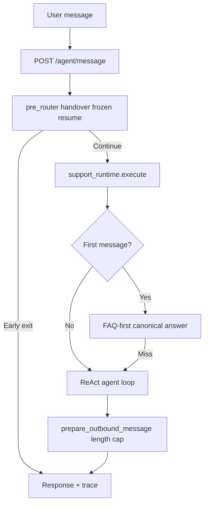

# Kai Kommu ChatBot  

An AI-powered assistant for **Kommu**.  
Designed to handle customer and internal support queries with **speed, accuracy, and bilingual support (English & Malay)**.

---

##  Features

- **Router-first Haystack runtime:** Canonical FAQ/workflow data compiled from `agent_workspace/02_knowledge/faq/master_faq.md` into `agent_workspace/compiled/*`  
- **Agent workspace:** Markdown-first core prompts, FAQ, and v2 skill metadata under `agent_workspace/` (see `agent_workspace/README.md` and `00_manifest.md`)  
- **Google Sheets Integration:** Warranty & stock lookups  
- **Multi-language:** English ↔ Bahasa Melayu auto-switching  
- **WhatsApp Integration (via Twilio)**  
- **Daily Auto-Refresh** of compiled runtime knowledge + warranty cache  
- **Debug, Health & Benchmark Tools** to test coverage and performance  

---

##  Setup

### 1) Clone & prepare environment

```bash
# Clone
git clone https://github.com/kommuai/kai.git
cd kai

# (Recommended) Python 3.10–3.12
python -m venv .venv
# Windows
.venv\Scripts\activate
# macOS / Linux
# source .venv/bin/activate

# Install deps
pip install -r requirements.txt
```

### 2) Configure environment

Create a `.env` file:

```bash
# Minimal required (examples)
DEEPSEEK_API_KEY=sk-xxxxxxxxxxxxxxxxxxxxxxxx
SOP_DOC_URL=https://docs.google.com/document/d/xxxxxxxxxxxxxxxxxxxx
WARRANTY_CSV_URL=https://docs.google.com/spreadsheets/d/e/.../pub?gid=0&single=true&output=csv
EXTRA_WARRANTY_CSV_URL=https://docs.google.com/spreadsheets/d/e/.../pub?gid=0&single=true&output=csv
```

Or hardcode in `config.py`.

### 3) Run locally

```bash
# App (FastAPI + uvicorn)
uvicorn app:app --host 0.0.0.0 --port 8000
# Health check
curl http://127.0.0.1:8000/docs
```

### 4) Run with Docker

```bash
docker compose up -d
# health
curl http://127.0.0.1:6090/
```

Docker mounts `./agent_workspace` at `/app/agent_workspace`. Session SQLite stays on `./data` → `/data/sessions.db` (see `00_manifest.md` frontmatter `session_store`).

**Env (optional):**

- `AGENT_WORKSPACE` — path to workspace root (default: `agent_workspace` next to `app.py`)
- `MASTER_FAQ_PATH` — override FAQ markdown path
- `CONTEXT_REGISTRY_YAML` — override path to `agent_workspace/04_context/context_registry.yaml`

Exposed endpoints (in Docker):

- `http://127.0.0.1:6090/agent/message`
- `http://127.0.0.1:6090/v2/agent/message`
- `http://127.0.0.1:6090/v2/agent/query`
- `http://127.0.0.1:6090/v2/agent/search`
- `http://127.0.0.1:6090/admin/refresh-sop`
- `http://127.0.0.1:6090/admin/reset_memory`

Route mode (trace label only; chat always uses `support_runtime` ReAct loop after `pre_router`):

- `KAI_ROUTE_MODE=hybrid` (default)
- `KAI_ROUTE_MODE=agent_first`
- `KAI_ROUTE_MODE=stable_only` — mapped to `hybrid` for backward compatibility

Both `POST /agent/message` and `POST /v2/agent/message` share the same handler in `api/v2/agent_message.py`.

Model backend (default DeepSeek, model-agnostic adapter):

- `KAI_LLM_PROVIDER=deepseek` (default)
- `KAI_LLM_MODEL=<provider_model_name>`
- `KAI_LLM_BASE_URL=<openai_compatible_base_url>`
- `KAI_LLM_API_KEY=<provider_api_key>`

Canonical runtime artifacts are compiled at startup into `agent_workspace/compiled/` (`intents.json`, `workflows.json`, `kb_chunks.jsonl`, `tool_policies.json`).

Haystack/Qdrant/rerank/observability toggles:

- `KAI_QDRANT_ENABLED=1`
- `KAI_QDRANT_URL=http://127.0.0.1:6333`
- `KAI_QDRANT_COLLECTION=kai_support`
- `KAI_RERANKER_BACKEND=provider`
- `KAI_GUARDRAILS_ENABLED=1`
- `KAI_TRACING_ENABLED=1`
- `KAI_CHATWOOT_ENFORCE_LIVE_HANDOVER=1` (on escalation, force Chatwoot conversation switch to live-agent mode; fail-closed on switch failure)
- `KAI_SOP_WRITEBACK_ENABLED=1` (on approved SOP/FAQ writeback paths, write updated `master_faq.md` back to Google Docs)
- `KAI_SOP_MERGE_SYNC_ENABLED=1` (enable scheduled bidirectional SOP merge-sync at 8:00 local time)
- `KAI_SOP_MERGE_SYNC_HOUR=8`
- `KAI_SOP_MERGE_SYNC_MINUTE=0`
- `GOOGLE_DOCS_SOP_DOC_ID=<google_doc_id>` (target SOP/FAQ Google Doc for writeback)
- `KAI_SMARTSERVA_TOOL_PATH=/app/integrations/smartserva/create_visitor_pass.py` (optional explicit path override for visitor-pass tool)

Machine-agent auth for `/v2/agent/*`:

- `KAI_SERVICE_KEYS=internal-key:public_info.read|repo.read|media.read`
- `KAI_GITHUB_TOKEN=<optional_github_token_for_higher_rate_limits>`
- Repo-reader scope is hard-locked to public repos under `https://github.com/kommuai`.

Admin endpoint auth for `/admin/*`:

- `ADMIN_TOKEN=<strong-admin-token>`
- Send `x-admin-token: <ADMIN_TOKEN>` header with admin requests.

---

##  Debug & Health Checks

### A) One-shot full system check (CLI)

```bash
python tools/debug_check.py
```

### E) Runtime evaluation harness (offline)

```bash
python tools/eval_support_runtime.py
```

### F) FAQ learning (post live-agent handback)

After a human handoff, when the user sends `resume`, Kai appends a **unified diff** suggestion to
`agent_workspace/02_knowledge/faq/agent_learnt_faq.md` (not loaded by the runtime retriever). Tune with
`KAI_FAQ_LEARN_ENABLED`, `KAI_FAQ_LEARN_ASYNC`, `KAI_FAQ_LEARN_FETCH_CHATWOOT`.

Expected output:

```
[SOP-DOC] Loaded FAQ content and refreshed compiled knowledge artifacts.
[WARRANTY] Loaded total rows: 476; 308 unique dongle ids; 98 phone/serial keys.
[LANG] Detector ready (EN/BM).
[OK] System is ready.
```

### B) Runtime checks (HTTP)

```bash
# Trigger SOP + warranty refresh manually
curl -X POST http://127.0.0.1:6090/admin/refresh-sop \
  -H "x-admin-token: <ADMIN_TOKEN>"

# Reset one conversation memory
curl -X POST "http://127.0.0.1:6090/admin/reset_memory?user_id=+6000000000" \
  -H "x-admin-token: <ADMIN_TOKEN>"
```

### B2) Force SOP merge-sync now (local executable)

```bash
cd /home/ting/workspace/kai
./tools/force_sop_sync.py
```

### C) Test message route manually

**CLI (recommended):**

```bash
python3 tools/kai_api_cli.py message "Hi, what cars are supported?"
python3 tools/kai_api_cli.py chat --phone +6000000000
python3 tools/kai_api_cli.py query "What is KommuAssist?" --api-key internal-key
```

Set `KAI_API_BASE_URL` if the server is not on `http://127.0.0.1:6090`.

**curl:**

```bash
curl -X POST http://127.0.0.1:6090/agent/message \
  -H "Content-Type: application/json" \
  -d '{"phone_number":"+6000000000","content":"Hi, what cars are supported?"}'
```

### D) Test machine-agent query (A2A)

```bash
curl -X POST http://127.0.0.1:6090/v2/agent/query \
  -H "Content-Type: application/json" \
  -H "x-api-key: internal-key" \
  -d '{"user_id":"agent-client","query":"What is KommuAssist?","lang":"EN"}'
```

---

##  Daily Auto-Refresh

Script path: `/home/deployment-user/bin/kai-refresh.sh`

Cron (every day 9:00 AM):

```bash
0 9 * * * /home/deployment-user/bin/kai-refresh.sh >> /home/deployment-user/kai-refresh.log 2>&1
```

Run manually:

```bash
/home/deployment-user/bin/kai-refresh.sh
tail -n 200 /home/deployment-user/kai-refresh.log
```

---

##  How the Chatbot Works (High-Level)

A chat message hits `POST /agent/message` or `POST /v2/agent/message` (same logic). **Pre-router** handles handover, frozen sessions, and resume. **Support runtime** runs FAQ-first on the first message, then the ReAct agent loop with tools (FAQ search, warranty, vehicle support, visitor pass, etc.). Outbound text is capped for WhatsApp (4096 chars).



---

##  Repo Layout

```bash
├── app.py                    # FastAPI entry (uvicorn app:app)
├── config.py                 # Env + path constants (.env loaded here)
├── .env                      # Local secrets (not in git)
├── kai/                      # Application package
│   ├── api/v2/               # HTTP routes (/agent/message, /admin/*)
│   ├── support_runtime/      # ReAct loop, FAQ, retrieval, tools
│   ├── services/             # pre_router, Chatwoot handover
│   ├── core/                 # SOP sync, policies, outbound delivery
│   ├── lib/                  # session, LLM client, sheets, media
│   └── integrations/         # SmartServa visitor pass, etc.
├── agent_workspace/          # FAQ + compiled knowledge (Docker volume)
├── data/sop/                 # SOP merge-sync state (not legacy FAISS)
├── data/                     # SQLite sessions, SOP assets
├── secrets/                  # Google service account JSON
├── tools/                    # debug_check, eval, SOP sync scripts
├── tests/
├── docs/
├── docker-compose.yml
└── requirements.txt
```

---

## Current Architecture Files

Use these as the primary runtime map:

- Runtime/API:
  - `app.py`
  - `api/v2/agent_message.py`
  - `api/v2/agent_query.py`
  - `support_runtime/`
- Chatwoot parity/session layer:
  - `services/kai_service.py`
  - `session_state.py`
- Knowledge + eval:
  - `agent_workspace/02_knowledge/faq/master_faq.md`
  - `agent_workspace/compiled/`
  - `tools/eval_support_runtime.py`
  - `tests/test_pre_router.py`
  - `tests/test_chatwoot_parity_contract.py`
  - `tests/test_support_runtime.py`

Architecture map (including removed legacy paths):

- `docs/architecture/current_architecture_map.md`

---


##  Troubleshooting

- `curl 127.0.0.1:8000` fails → ensure `uvicorn app:app` is running.  
- In Docker, use **6090** not 8000.  
- SOP outdated → run `python tools/debug_check.py`.  
- Always “live agent” → call `/admin/reset_memory?user_id=<phone_number>`.  
- Wrong language → check pinned language.  
