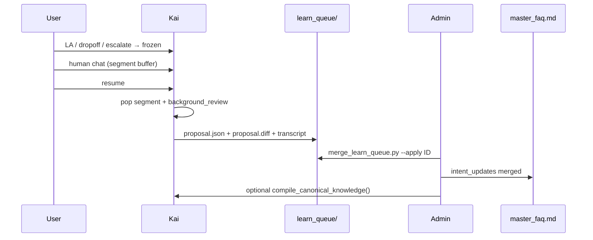

# Hermes Phase 2 — FAQ learning pipeline

Phase 2 moves post-handoff FAQ learning from append-only `agent_learnt_faq.md` to a **review queue** before merge into `master_faq.md`.

## Flow



## Layout (`agent_workspace/02_knowledge/faq/learn_queue/<proposal_id>/`)

| File | Purpose |
|------|---------|
| `meta.json` | `status`, `trigger`, `user_id`, timestamps |
| `transcript.txt` | Session + optional Chatwoot fetch |
| `proposal.json` | Structured `intent_updates` for deterministic merge |
| `proposal.diff` | Human-readable unified diff (review) |

Status: `pending` → `merged` | `rejected`.

## Triggers

| Trigger | When | Default |
|---------|------|---------|
| `resume` | User types resume/unfreeze after LA handoff | **on** (`schedule_faq_learn_after_handback`) |
| `handover` / `escalate` | Snapshot without pop | **off** (`KAI_FAQ_LEARN_ON_HANDOVER=0`) |

## Config

| Env | Default | Meaning |
|-----|---------|---------|
| `KAI_FAQ_LEARN_USE_QUEUE` | `1` | Write learn_queue proposals |
| `KAI_FAQ_LEARN_LEGACY_APPEND` | `0` | Also append to `agent_learnt_faq.md` |
| `KAI_FAQ_LEARN_ON_HANDOVER` | `0` | Learn on escalate without resume |
| `FAQ_LEARN_QUEUE_DIR` | `agent_workspace/02_knowledge/faq/learn_queue` | Queue root |

## Admin CLI

```bash
cd /home/ting/workspace/kai
python3 tools/merge_learn_queue.py --list
python3 tools/merge_learn_queue.py --show <proposal_id>
python3 tools/merge_learn_queue.py --apply <proposal_id> --compile
python3 tools/merge_learn_queue.py --reject <proposal_id>
```

## Code map

- `kai/support_runtime/faq_learn.py` — LLM review → queue (+ optional legacy)
- `kai/support_runtime/faq_learn_queue.py` — queue I/O
- `kai/support_runtime/background_review.py` — async scheduling
- `kai/support_runtime/faq_merge.py` — apply `proposal.json` to master
- `tools/merge_learn_queue.py` — admin merge/reject

## Phase 3 (deferred)

Folder layout cleanup under `agent_workspace/` and optional bridge Permission UI for approve/reject.
