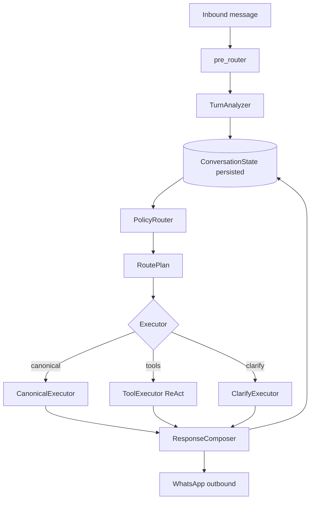

# Turn orchestrator architecture (proposal)

Status: **design** — replaces FAQ-hint + free ReAct as the primary router.

## Problem statement

Production today runs:

```
pre_router → SupportRuntimeService.execute → (weak FAQ hint) → ReActAgentLoop → outbound
```

Routing is **implicit**: the LLM reads chat text + optional canonical hint and decides everything. That fails on:

- **Slot-only follow-ups** (`10200` after “installer in Penang?”) — retrieval query has no intent signal.
- **Topic drift** — DIY install FAQ wins over `regional_installer` because `pick_best_canonical` is text-similarity only.
- **Contradictions** — model says “no Penang installer” while `master_faq.md` says yes.
- **Loops** — assistant text in history becomes the strongest “prompt” for the next turn.

Regex `last_topic` and `<kai-session-context>` are **hints**, not **control**. Hints do not bind retrieval, executor choice, or answers.

Your docs (`routing.md`) already describe a deterministic pipeline; `IntentRouter` was removed. This design **restores that idea** with explicit **conversation state** and **compiled workflows**, without keyword clarify menus.

---

## Design principles

1. **State before model** — Every turn updates a structured `ConversationState` first; the LLM executes a plan, it does not invent routing.
2. **Compiled knowledge is authoritative** — `intents.json` + FAQ are the source of truth for factual support answers.
3. **ReAct is a specialist** — Used only when `RoutePlan` requires tools/reasoning (vehicle ACC check, diagnostics, backlog).
4. **No grounding gate** — Answers are not blocked for missing `source_ids`; evidence is attached for trace/UI only.
5. **Data-driven workflows** — Multi-turn flows (partner installer, warranty+dongle, QR pass) live in compiled metadata, not Python `if "penang" in text`.

---

## Target flow



---

## Core types

### ConversationState (SQLite, per `user_id`)

```python
@dataclass
class ConversationState:
    version: int = 1
    active_workflow_id: str | None = None      # e.g. partner_installer_inquiry
    workflow_phase: str | None = None          # e.g. awaiting_postcode
    active_intent_id: str | None = None        # e.g. regional_installer
    slots: dict[str, str] = field(default_factory=dict)
    # slots: region, postcode, vehicle, year, dongle, plan, visit_date, ...
    last_route: str | None = None              # canonical | react | clarify
    last_source_ids: list[str] = field(default_factory=list)
    turn_count: int = 0
```

**Replaces** ad-hoc `last_topic` / summary-only stickiness for **routing decisions**. Chat `history` remains for tone; state drives behaviour.

### RoutePlan

```python
@dataclass
class RoutePlan:
    executor: Literal["canonical", "react", "clarify"]
    intent_id: str | None = None
    workflow_id: str | None = None
    phase: str | None = None
    clarify_key: str | None = None             # template id from compiler
    tool_policy: str | None = None             # vehicle_support | diagnostic | ...
    retrieval_query: str = ""                  # built from state + message
    evidence_required: bool = False            # for metadata only, not blocking
```

### TurnAnalyzer output

```python
@dataclass
class TurnAnalysis:
    message_type: Literal["factual", "slot_fill", "correction", "reaction", "chitchat"]
    slot_updates: dict[str, str]
    workflow_signal: str | None                # continue | switch | cancel
    intent_candidates: list[tuple[str, float]] # intent_id, score
```

**TurnAnalyzer** = hybrid (not hardcoded Penang/Johor lists in Python):

1. **Slot extractor** — postcode regex, year, dongle id, region NER from compiled `reference_data` / alias index.
2. **Intent matcher** — alias index from `intents.json` (BM25 or embedding), scoped by `active_workflow_id` when set.
3. **Optional small LLM classify** — JSON only: `message_type`, `workflow_signal`, ambiguous intent disambiguation; temperature 0.

When `active_workflow_id=partner_installer_inquiry` and user sends `10200`, analyzer sets `slot_updates={"postcode":"10200","region":"Penang"}` and `message_type=slot_fill` **without** re-matching DIY install.

---

## PolicyRouter (deterministic)

Reads `ConversationState` + `TurnAnalysis` + `compiled/workflows.json` + `intents.json`.

**Rules (examples, expressed as data in workflows):**

| Condition | RoutePlan |
|-----------|-----------|
| `workflow_phase=awaiting_postcode` and `postcode` filled | `canonical`, `intent_id=regional_installer`, phase=`confirm_partner` |
| User asks installer + region, no postcode | `clarify`, `clarify_key=installer_postcode` |
| `intent_id` matched, `route_type=known_faq_intent`, slots satisfied | `canonical` |
| `route_type=vehicle_support_check_intent` | `react`, `tool_policy=vehicle_support` |
| `route_type=troubleshooting_intent` | `react`, `tool_policy=diagnostic` |
| `message_type=chitchat` | `react` with short system addendum or template greeting |
| `message_type=reaction` | `canonical` or template empathy, **no** workflow reset |

**No** `pick_clarify_for_intent` keyword trees. Clarify templates come from workflow phase definitions.

---

## Executors

### CanonicalExecutor

- Loads `IntentRecord` from `intents.json`.
- Optionally personalizes slots: “Yes — partner installer in **Penang** for postcode **10200**…”
- Sets `source_ids=[faq:intent_id]`, `capability_used=canonical_executor`.
- **Always used** when PolicyRouter says `canonical`, regardless of LLM confidence.

### ToolExecutor (narrow ReAct)

- Receives `RoutePlan.tool_policy` → **allowlisted tools only** (e.g. vehicle: `search_kommu_support`, `search_web`).
- System prompt slice for that policy only (not full 8-tool menu every turn).
- Injected **retrieval_query** and prior tool results from state if re-entering.
- Max steps capped per policy (e.g. 4 for vehicle, 8 for diagnostic).

### ClarifyExecutor

- One question from workflow template or `clarify_validation` if LLM wording needed.
- Sets `workflow_phase` to awaiting slot.

---

## Compiler extensions (data, not code branches)

Extend `master_faq.md` / compiler output:

```yaml
## intent: regional_installer
workflow: partner_installer_inquiry
route_type: known_faq_intent
slots:
  - name: region
    required: false
  - name: postcode
    required: false
phases:
  - id: awaiting_postcode
    when_missing: [postcode]
    clarify_template: installer_postcode
  - id: ready
    when_present: [postcode]
    answer_template: regional_installer_with_location
```

Compiled into `intents.json` metadata + `workflows.json` custom section.

**Postcode-only messages** bind to active workflow via state, not via enriching “Context: previous user line”.

---

## Retrieval

**Single function:** `build_retrieval_query(state, analysis, user_text)`:

```
{workflow_id} {active_intent_id} {slots as key=value} {user_text}
```

Feed to `HybridRetriever` for **hint/evidence** on ReAct turns; CanonicalExecutor skips retrieval when `intent_id` is already resolved.

---

## Session layers (clear separation)

| Layer | Storage | Used for |
|-------|---------|----------|
| `ConversationState` | `sessions.data.conversation_state` | Routing, slots, workflow phase |
| `history` | last N text turns | LLM tone, `search_session_memory` |
| `session_summary` | tail summary | Human-readable debug / optional analyzer input |
| `memory_facts` | `memory_facts` table | Long TTL identity/device |
| FTS index | `session_search` | “what did I say earlier” tool |

---

## API / service change

`SupportRuntimeService.execute` becomes:

```python
def execute(self, text, lang, user_id) -> RuntimeResult:
    state = load_conversation_state(user_id)
    analysis = turn_analyzer.analyze(text, state, history, lang)
    state = merge_state(state, analysis)
    plan = policy_router.route(state, analysis)
    result = executors.run(plan, text, lang, user_id, state, history)
    save_conversation_state(user_id, state)
    append_history(...)
    return result
```

`ReActAgentLoop` is **not** the top-level entry point.

---

## What this fixes (Penang thread)

| Turn | Today | With orchestrator |
|------|-------|-------------------|
| Installer in Penang? | OK clarify | `workflow=partner_installer_inquiry`, `phase=awaiting_postcode` |
| `10200` | Wrong DIY link | `slot_fill` → `canonical regional_installer` with postcode |
| Someone install for me | Hallucination no Penang | `workflow_signal=continue`, canonical + slots |
| What about Johor? | Loop | `slot_updates={region:Johor}`, same workflow, canonical/Johor copy |
| Install at Johor | Loop | `awaiting_postcode` for Johor or confirm partner |

---

## Migration phases

| Phase | Deliverable | Risk |
|-------|-------------|------|
| **1** | `ConversationState` + persist; TurnAnalyzer slot + intent index | Low — parallel read |
| **2** | `PolicyRouter` + `CanonicalExecutor` for `known_faq_intent` | Medium — A/B vs ReAct |
| **3** | Workflow compiler metadata (`partner_installer`, `pricing`, `warranty`) | Medium |
| **4** | Narrow `ToolExecutor`; ReAct only for vehicle/diagnostic | Higher — prompt changes |
| **5** | Deprecate FAQ-hint-as-system-message; remove regex `infer_session_topic` | Cleanup |

---

## Non-goals

- Re-introducing **grounding gates** that swap user-visible answers.
- Keyword **`pick_clarify_for_intent`** menus.
- FAQ-first only on message 1 — canonical path applies whenever PolicyRouter selects it.

---

## Relation to Cursor / Hermes

| Cursor / Hermes | Kai orchestrator |
|-----------------|------------------|
| Full thread + tool trace in context | `history` + structured **state** (thread is incomplete for routing) |
| Model chooses tools freely | **PolicyRouter** chooses executor + allowlist |
| Compaction summarization | Workflow phase + slots survive compaction |
| Rules in project | `intents.json` + workflows compiled from `master_faq.md` |

---

## Files to add (implementation sketch)

```
kai/conversation/
  state.py           # ConversationState load/save
  analyzer.py        # TurnAnalyzer
  policy_router.py   # PolicyRouter
  retrieval_query.py # build_retrieval_query
kai/executors/
  canonical.py
  clarify.py
  react_tool.py      # slim ReAct
kai/support_runtime/compiler.py   # extend workflow metadata
```

---

## Success metrics

- Partner installer multi-turn: postcode → canonical partner answer (no DIY URL) ≥ 95% in eval set.
- Region switch (Penang → Johor): updates slot, no DIY/HQ loop.
- No regression on vehicle support (still uses ToolExecutor + tools).
